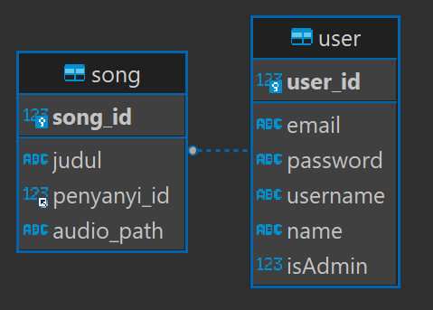

# Pekotify-Premium-REST

## About

Membuat REST service yang bisa menangani pengelolaan lagu premium oleh seorang penyanyi. Service ini dibuat menggunakan bahasa NodeJS dan modul Express.

## How to use
Jalankan sebagai docker container
1. Buka terminal
2. Jalankan perintah `docker build -t pekotify-premium-rest:latest .`
2. Jalankan perintah `docker-compose up`

Jalankan sebagai aplikasi NodeJS
1. Buka terminal
2. Jalankan perintah `npm install`
3. Jalankan perintah `node index.js`

## Database Schema

## Work Distribution
### REST
- Backend Binotify Premium Fungsi API Endpoints               : 13520144
- Backend Binotify Premium Fungsi API Services                : 13520144
- Backend Binotify Premium Fungsi Docker & Nodemon            : 13520039
- Backend Binotify Premium Fungsi Song File Upload            : 13520039
- Backend Binotify Premium Fungsi SOAP Endpoint Integration   : 13520091

